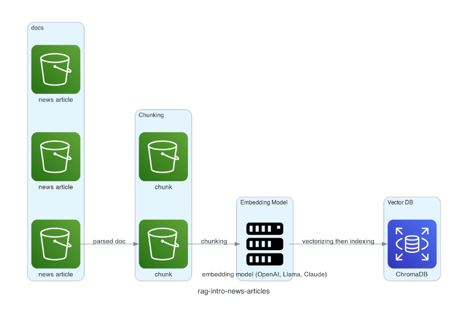

intro to rag training

Diagramming done via DiagramAsCode

## Rag Training - Intro
It takes about 21 news articles in text files,
loads them into a simulated pipeline,
splits text into chunks (specified chunk size and overlap as an array) into chunks,
passing each chunk through an embedding model (text-embedding-3-small via OpenAI),
which vectorizes it and then indexes it and stores it into a vector database.

The subsequent queries will query the vector database.

It is a simple exercise to code up a rag retrieval to query (using an LLM) a specific set of documents.

